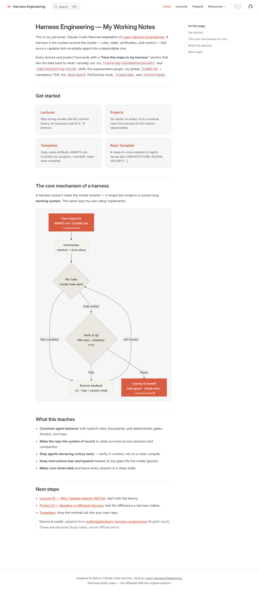
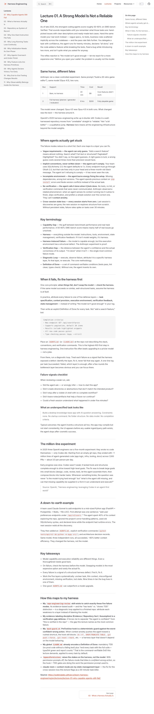

# Harness Engineering — Personal Knowledge Base

> **Archived (2026-07-01):** the SOPs and templates most relevant to
> role-manifest and quality conventions (`layered-domain-architecture.md`,
> `evaluator-rubric.md`, `clean-state-checklist.md`, `quality-document.md`)
> have been folded into
> [agent-fleet-orchestrator](https://github.com/ZeekrBaha/agent-fleet-orchestrator)'s
> `docs/reference/` as that project's source-of-truth. This repo remains as
> the full knowledge base and course adaptation; no further sync is planned.

My Claude-Code-flavored adaptation of the [Learn Harness Engineering](https://walkinglabs.github.io/learn-harness-engineering/) course (English track), rendered as a VitePress site that looks like the original.

## §1 Mental model

A **harness** is everything around the model that makes a capable-but-unreliable agent reliable: explicit rules, persistent state, verification gates, and a control loop. Strong models don't fail because they're dumb — they fail because nothing constrains scope, preserves context, or checks the work. This repo collects the theory (lectures), practice (projects), and copy-ready artifacts (templates) — each tied back to my actual setup.

## §2 Architecture

A VitePress docs site. Markdown is the source of truth; `.vitepress/` provides the theme and navigation.

```
harness-engineering/
├── index.md                 # homepage (hero + card grid + mermaid loop)
├── .vitepress/
│   ├── config.mjs           # nav, sidebar, mermaid, local search
│   └── theme/               # terracotta accent + card-grid styles
├── lectures/                # lecture-01 … lecture-12
├── projects/                # index + project-01 … project-06
├── templates/               # AGENTS.md, CLAUDE.md, progress, handoff, checklists
├── sops/                    # standard operating procedures
├── reference/               # method map, startup flow, prompt calibration
└── repo-template/           # ready-to-clone agent-facing doc skeleton
```

## §3 What it does

Teaches the 12 harness lectures and 6 projects, each adapted to my harness with a **"How this maps to my harness"** section connecting the concept to my skills (`create-app-implementation-docs`, `repo-engineering-review`), the superpowers plugin, global `CLAUDE.md` + mandatory TDD, the `bash-guard` PreToolUse hook, `claude-mem`, and `context-mode`.

## §4 Differentiator

The source course is tool-agnostic (Codex + Claude Code). This version is personalized: every idea is mapped to a concrete tool I already run, so it doubles as an audit of my own harness — what I have, what's missing, what to add.

## §5 How to run

```bash
cd ~/Desktop/llm-ai-projects/harness-engineering
npm install
npm run docs:dev      # local preview at http://localhost:5173
npm run docs:build    # static build into .vitepress/dist
npm run docs:preview  # serve the built site
```

Requires Node 18+. No API keys.

## §6 Repo map

- `index.md` — homepage.
- `.vitepress/config.mjs` — site config: nav, sidebar, mermaid, local search, terracotta logo.
- `.vitepress/theme/` — `index.js` (extends default theme) + `style.css` (brand + card-grid + mermaid framing).
- `lectures/lecture-NN.md` — adapted theory.
- `projects/` — `index.md` overview + `project-NN.md` assignments.
- `templates/` — drop-in artifacts for any repo.
- `sops/`, `reference/`, `repo-template/` — procedures, quick reference, and a clonable doc skeleton.

## §7 Tech stack

VitePress 1.x · vitepress-plugin-mermaid · mermaid 11 · local search. Static, zero backend.

## §8 Credit

Adapted from [walkinglabs/learn-harness-engineering](https://github.com/walkinglabs/learn-harness-engineering) (MIT-style course content). Personal study notes — not an official mirror, not affiliated with the original authors.

## §9 Status / limitations / next steps

- **Built:** full course — 12 lectures, 6 projects + overview, 7 templates, 4 SOPs, 4 reference docs, and a 12-file `repo-template/` skeleton, plus the VitePress UI (config, theme, homepage). `npm run docs:build` passes clean.
- **Limitations:** content is an adaptation of the source course, not original research; the "How this maps to my harness" sections reflect my setup as of June 2026 and will drift as skills/hooks change.
- **Next steps:** wire a `Stop`-hook test gate per-project (see lecture 09/12), and periodically re-run `repo-engineering-review` against this repo to keep the README standard honest.

## §10 Screenshots

Homepage — hero, card grid, and the mermaid harness loop (terracotta theme):



A rendered lecture page with sidebar navigation and on-page outline:


