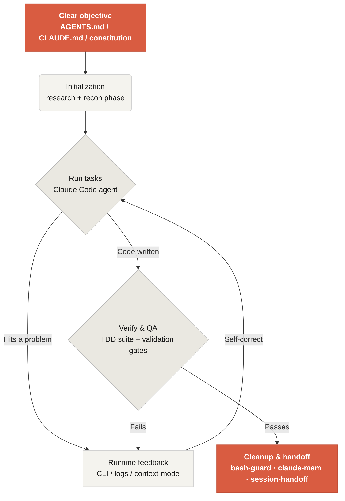

# Harness Engineering — My Working Notes

This is my personal, Claude-Code-flavored adaptation of [Learn Harness Engineering](https://walkinglabs.github.io/learn-harness-engineering/). A *harness* is the system around the model — rules, state, verification, and control — that turns a capable-but-unreliable agent into a dependable one.

Every lecture and project here ends with a **"How this maps to my harness"** section that ties the idea back to what I actually run: my `create-app-implementation-docs` and `repo-engineering-review` skills, the superpowers plugin, my global `CLAUDE.md` + mandatory TDD, the `bash-guard` PreToolUse hook, `claude-mem`, and `context-mode`.

## Get started

  <a href="./lectures/lecture-01" class="card">
    <h3>Lectures</h3>
    
Why strong models still fail, and the theory of harnesses that fix it. 12 lectures.

  </a>
  <a href="./projects/" class="card">
    <h3>Projects</h3>
    
Six hands-on builds, from a minimal rules-first harness to full runtime observability.

  </a>
  <a href="./templates/" class="card">
    <h3>Templates</h3>
    
Copy-ready artifacts: AGENTS.md, CLAUDE.md, progress + handoff, clean-state checklist.

  </a>
  <a href="./repo-template/" class="card">
    <h3>Repo Template</h3>
    
A ready-to-clone skeleton of agent-facing docs (ARCHITECTURE, DESIGN, SECURITY…).

  </a>

## The core mechanism of a harness

A harness doesn't make the model smarter — it wraps the model in a closed-loop **working system**. The same loop my own setup implements:

## What this teaches

<ul class="index-list">
  <li><strong>Constrain agent behavior</strong> with explicit rules, boundaries, and deterministic gates (hooks), not hope.</li>
  <li><strong>Make the repo the system of record</strong> so state survives across sessions and compaction.</li>
  <li><strong>Stop agents declaring victory early</strong> — verify in runtime, not on a clean compile.</li>
  <li><strong>Keep instructions lean and layered</strong> instead of one giant file the model ignores.</li>
  <li><strong>Make runs observable</strong> and leave every session in a clean state.</li>
</ul>

## Next steps

<ul class="index-list">
  <li><a href="./lectures/lecture-01">Lecture 01 — Why Capable Agents Still Fail</a>: start with the theory.</li>
  <li><a href="./projects/project-01">Project 01 — Baseline vs Minimal Harness</a>: feel the difference a harness makes.</li>
  <li><a href="./templates/">Templates</a>: drop the minimal set into your next repo.</li>
</ul>

> **Source & credit:** adapted from [walkinglabs/learn-harness-engineering](https://github.com/walkinglabs/learn-harness-engineering) (English track). These are personal study notes, not an official mirror.
