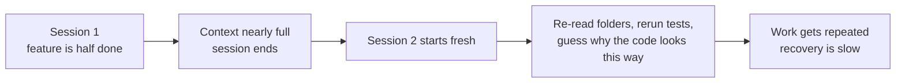
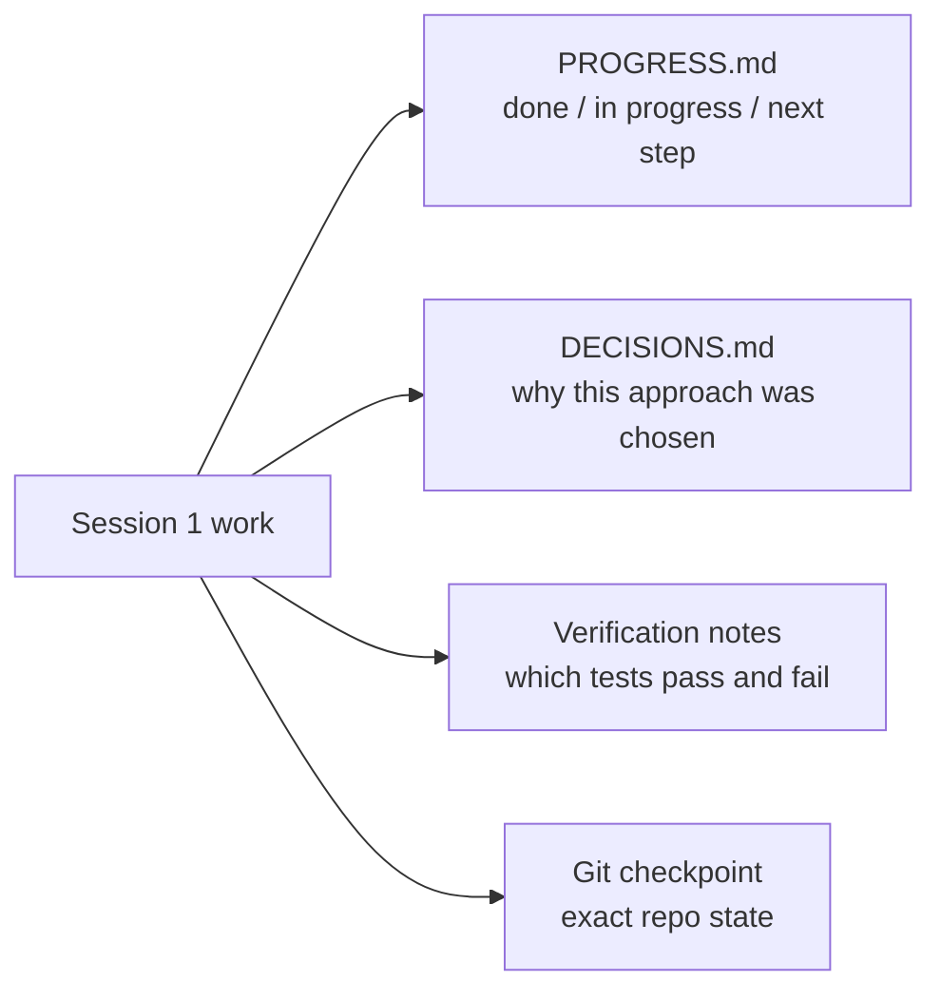

# Lecture 05 — Why Long-Running Tasks Lose Continuity

Any task worth doing with an agent eventually outgrows a single context window. The window fills, the session ends or compacts, and a fresh session starts cold — re-reading folders, re-running tests, and guessing why the code was written the way it was. Work gets repeated and recovery is slow. This lecture is about why that happens and how structured state persistence lets a new session pick up where the last one left off.

## The core problem: continuity is not memory

Continuity is the property that a *fresh* agent session can resume the task without re-deriving everything. It is not the same as a big context window. No matter the advertised size (128K, 200K, 1M), a long task will exhaust it. After exhaustion you get one of two lossy moves:

- **Compaction** — summarize earlier conversation in the same session. Keeps the *what*, usually loses the *why* (why option B beat option A, why an optimization was skipped). Worse, it does not remove **context anxiety**: the agent still senses the window is tight and rushes to finish.
- **Reset** — open a new session and rebuild from persisted artifacts. Clean, but only as good as the artifacts you left behind.

The failure mode when continuity breaks:



## Key terms

- **State persistence files** — artifacts that let a new session resume unambiguously. Minimum viable set: a progress log, verification records, and the next actions.
- **Rebuild cost** — the time a new session needs to reach an executable state. A good harness compresses this from ~15 minutes to ~3 minutes.
- **Drift** — the gap between the agent's understanding and the actual repo state. Every session boundary adds drift; uncontrolled, it compounds.
- **Context anxiety** — a behavior Anthropic observed: as agents near the context limit they finish early to avoid information loss. At root it is irrational resource anxiety, and a bigger window does not cure it.

## The solution: externalize state, don't trust memory

Treat the agent like an engineer whose short-term memory is wiped every session. Before "clocking out," it writes down what was done, why, and what's next. Session-1 work fans out into durable artifacts:



The four artifacts are complementary: PROGRESS captures *state*, DECISIONS captures *rationale*, verification notes capture *truth* (what actually passes), and the git checkpoint captures the *exact* repo so claims and reality cannot drift apart.

## The clock-in ritual

A session-start routine removes guesswork:

```markdown
## At session start (clock in)
1. Read PROGRESS.md for current state
2. Read DECISIONS.md for important decisions
3. Run `make check` to confirm the repo is in a consistent state
4. Continue from PROGRESS.md "Next Steps"
```

## Session handoff template

Keep the handoff minimal and honest — three sections an incoming session can act on immediately:

```markdown
## Completed
- Added markdown import support
- Added a basic document list in the renderer

## Broken or Unverified
- Import succeeds for `.md` but fails for large `.txt` files
- The app starts, but the detail view is not wired up

## Next Best Step
- Fix the `.txt` import path
- Verify import end-to-end
- Then add the document detail panel
```

A more structured variant carries four fields: **repo state** (commit hash), **runtime state** (test pass rate), **blockers**, **next actions**. The test: a fully fresh session should restore the project from this template alone — no chat history.

## Continuity checklist

- Can a fresh agent identify recent work in under five minutes?
- Is the current stable startup path documented?
- Is unfinished work clearly identified?
- Is the next best task visible without reading old chat logs?

## Key takeaways

- Context windows are a finite resource. Long tasks span sessions, and sessions lose information — this is objective reality, not a bug to wait out.
- The fix is not a bigger window, it is better state persistence. Progress files, decision logs, and git checkpoints work together.
- Treat the agent as an engineer whose short-term memory is wiped each session: before clocking out, write down what, why, and next.
- Rebuild cost is the metric that matters. Aim for an executable state within ~3 minutes.
- Mixed strategy wins: keep short tasks in-session; carry long tasks across sessions with structured artifacts.

## How this maps to my harness

- This is already one of my strongest areas. **claude-mem** auto-captures cross-session observations and decisions — that is my durable DECISIONS log, queryable instead of re-derived.
- **context-save** writes the handoff (git state, decisions, remaining work); **context-restore** is the clock-in ritual that loads the most recent state, even across Conductor workspace handoffs. I should make a `session-handoff.md` the canonical artifact these read/write.
- **context-mode** compaction is the "keeps what, loses why" case the lecture warns about — so I lean on persisted artifacts (memory + saved context) rather than trusting in-session summaries for rationale.
- My TDD loop produces the verification record for free: which tests are RED vs GREEN *is* the runtime-state field of the handoff. I should record the pass/fail snapshot at clock-out.
- Every clock-out should end on a clean git checkpoint so the persisted "next step" and the actual repo cannot drift.
- Concrete target: a fresh Opus session should reach an executable state in under ~3 minutes using only the persisted handoff — no scrollback required.

**Source:** https://walkinglabs.github.io/learn-harness-engineering/en/lectures/lecture-05-why-long-running-tasks-lose-continuity/
