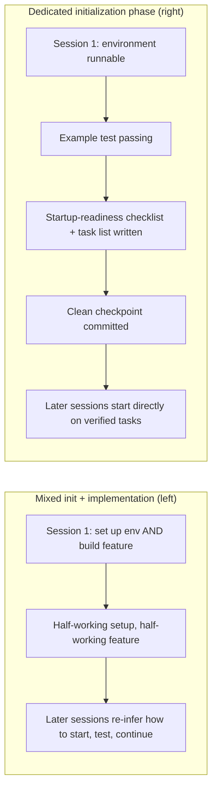

# Lecture 06 — Why Initialization Needs Its Own Phase

The temptation on a new project is to let the agent set up the environment *and* ship the first feature in the same session. It feels efficient. It is not. Initialization and implementation have different optimization targets, and mixing them drags both down. This lecture argues that initialization should be its own phase whose output is infrastructure, not business code.

## Two phases, two goals

- **Initialization phase** — the first phase in the agent's lifecycle. It only establishes the prerequisites for later implementation: a runnable environment, a verifiable test, a startup-readiness checklist, and a task breakdown. No feature development. Its deliverable is *infrastructure*, not business code.
- **Implementation phase** — everything after, where features are built against that infrastructure.

Mixing the two:



## The startup-readiness checklist

A project is unambiguously operable by a fresh session when all four conditions hold:

1. **Can start** — there is a canonical startup command.
2. **Can test** — there is a canonical verification command.
3. **Can see progress** — there is a first progress artifact.
4. **Can pick up next steps** — the next task is visible without tribal knowledge.

All four are required. Drop one and a later session has to re-infer it.

## Initializer output checklist

The initialization phase is done when it can answer yes to each:

- Is there a canonical startup command?
- Is there a canonical verification command?
- Is there a first progress artifact?
- Is there a stable first commit?
- Is there a visible feature surface for later runs?

## From scratch vs. from template

Starting **from scratch** means the agent infers project structure from an empty directory — slow and inconsistent. Starting **from a template** means standardized infrastructure is already in place. Templates win decisively. Encode your conventions once:

```markdown
## Project Structure
- src/            — Source code
- src/components/ — React components
- src/api/        — API client
- tests/          — Test files
```

This echoes the "repository as operational record" principle from OpenAI's Codex harness guidance: establish clear operational structure on the very first run, or every new session has to re-infer your conventions.

## Always ready to hand off

At any moment the project should be in a state where a fresh agent can take over by *reading the repo* — no verbal explanation. That is the property a dedicated initialization phase buys you.

## How to measure it

- **Time from start to first passing test** — the core efficiency metric for initialization.
- **Success rate of subsequent sessions** — the share of later sessions that execute tasks without relying on implicit knowledge. The best signal of initialization quality.

A useful experiment: take a moderately complex project. *Approach A* — initialize and do first implementation together. *Approach B* — spend one session on dedicated initialization, start implementing in session 2. After four sessions, compare time-to-first-passing-test, rebuild cost, and feature completion rate.

## Key takeaways

- Initialization and implementation have different optimization targets — mixing them drags both down.
- Initialization's output is not business code; it is infrastructure: runnable environment, verifiable tests, startup-readiness checklist, task breakdown.
- Validate initialization with the four conditions: can start, can test, can see progress, can pick up next steps.
- Starting from a template beats starting from scratch — preset standardized infrastructure.
- Time invested in initialization is recovered over the next 3–4 sessions. It is upfront investment, not overhead.

## How this maps to my harness

- My **create-app-implementation-docs** pipeline *is* the dedicated initialization phase. The constitution → research → requirements steps produce infrastructure-as-documents before any feature code — exactly "output is infrastructure, not business code."
- The pipeline's `research.md`/`requirements.md` gates are my "initializer agent": they must be satisfied before implementation unlocks, mirroring the four-condition startup-readiness checklist.
- The locate-the-project / research phase and **repo-engineering-review**'s recon step are the "inspect structure before judging / before building" discipline — re-infer nothing that can be written down once.
- My TDD law gives me the second checklist item for free: "can test" means the example/verification command exists and a first test is GREEN before features begin.
- The portfolio-README numbered-sections convention and a project `CLAUDE.md` are my template — they encode conventions so later Opus sessions don't re-derive structure (the "repository as operational record" principle).
- Metric to track: time-to-first-passing-test and subsequent-session success rate, to prove the spec-first phase pays back within 3–4 sessions rather than feeling like overhead.

**Source:** https://walkinglabs.github.io/learn-harness-engineering/en/lectures/lecture-06-why-initialization-needs-its-own-phase/
