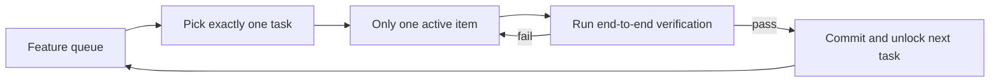

# Lecture 07. Draw Clear Task Boundaries for Agents

You tell Claude Code to "add user authentication," and it starts modifying the database schema, writing routes, changing frontend components, and — while it's in there — refactoring the error-handling middleware. Two hours later: 12 files touched, 800 new lines, and not a single feature works end-to-end.

Agents are born with an impulse to "do a little extra" — they see something adjacent and just handle it along the way. The problem: doing many things at once almost guarantees none of them get done well.

Anthropic's *Effective harnesses for long-running agents* is explicit: broad prompts make agents "start multiple things at once" rather than "finish one thing first." OpenAI's Codex practice found the same — tasks without explicit scope control see completion rates collapse. This is not a model problem. It's a harness problem. You didn't draw the boundary.

## Attention Is a Finite Resource

Not a metaphor — arithmetic. If context capacity is `C` and the agent activates `k` tasks at once, each gets ~`C/k` reasoning resources. When `C/k` drops below the threshold to finish a single task, none finish.

Ask Claude Code to "add user registration" and watch the drift:

1. Create a User model
2. Write the registration route
3. Notice email verification is needed → add a mail service
4. Notice passwords need hashing → pull in bcrypt
5. Notice error handling is inconsistent → refactor the global middleware
6. Notice the test layout is messy → reorganize the directory

Six steps, every one half-done, no end-to-end verification, tight coupling between half-baked pieces, and the next session inherits a puzzle.

Anthropic's data backs this: a "small next step" strategy (effectively WIP=1) shows **37% higher completion** than broad prompting. And lines of code correlate *negatively* with feature completion — more code written, fewer features done. Biting off more than you can chew, in numbers.

## WIP=1 Workflow



With WIP=1, each task gets the full budget `C` and reaches a passing state. With WIP=5, each gets `C/5` and you get five partial implementations, a low verified-completion rate, and heavy rework next session.

## Core Concepts

- **Overreach** — Activating more tasks in a session than optimal. Quantifiable: 5 features started, 0 passing end-to-end is overreach.
- **Under-finish** — The fraction of activated tasks that pass end-to-end falls below threshold. Code written, tests not passing.
- **WIP Limit** — From Kanban: cap in-flight work. For agents, WIP=1 is the safe default — finish one before starting the next.
- **Completion Evidence** — The verifiable condition for "in progress → done." Without it, the agent substitutes "the code looks fine" for "the behavior passes."
- **Scope Surface** — A DAG of work units (edges = dependencies), each in one of four states: `not_started`, `active`, `blocked`, `passing`.
- **Completion Pressure** — The force the harness applies via WIP limits and evidence requirements, forcing the agent to finish before starting anew.

## Two Sides of the Same Coin

Overreach and under-finish amplify each other: overreach dilutes attention, dilution causes under-finish, the half-finished code raises complexity, which drives more overreach next task. Little's Law (`L = λ·W`) says high work-in-progress `L` inflates lead time `W` per task — each feature takes longer to reach verified completion and is likelier to fail. Humans at least have an intuition for "enough"; agents have none. Generating "let me also fix this" costs the model almost nothing in tokens, but every extra edit dilutes attention.

## How to Do It Right

**1. Enforce WIP=1.** State it plainly in `CLAUDE.md`/`AGENTS.md`:

```
## Work Rules
- Work on one feature at a time
- Start the next only after the current passes end-to-end verification
- Don't "also refactor" B while implementing A
```

**2. Define executable completion evidence per task.** Done is "behavior verification passes," not "code is written":

```
F01: User Registration
  Verification: curl -X POST /api/register -d '{"email":"t@x.com","password":"123456"}' | jq .status == 201
  State: passing
```

**3. Externalize the scope surface** in a machine-readable file (JSON/Markdown) so any new session reads it and knows what's active, what counts as done, what passed.

**4. Monitor Verified Completion Rate** (VCR = verified ÷ activated). Block new activations when VCR < 1.0.

## Real-World Case

REST API, 8 features:

- **Unconstrained:** session 1 activates 5 features, ~800 lines / 12 files, 20% pass (only registration works). By session 3, 3 of 8 done.
- **WIP=1:** session 1 does registration only, ~200 lines / 4 files, 100% pass, clean commit. By session 4, 7 of 8 done (8th blocked externally).

Less total code (800 vs 1200), more *effective* code. Completion 87.5% vs 37.5%.

## Key Takeaways

- WIP=1 is the default safe setting — finish one, then start the next.
- Completion evidence must be executable — "curl returns 201," not "looks fine."
- Externalize the scope surface as a file, not a chat aside.
- Overreach and under-finish are symbiotic — fix one, fix both.
- "Do less but finish" beats "do more but leave half-done." Lines of code and completion are negatively correlated.

## How this maps to my harness

- **My global "minimal changes" rule *is* WIP=1 in prose** — "modify only what was asked, no drive-by refactors" is the exact antidote to step-5 "while I'm here" overreach. Keep it loud at the top of `CLAUDE.md`.
- **superpowers `writing-plans` already enforces bite-sized tasks** — lean on it to slice broad requirements into one-session atomic units with explicit dependencies, which is the scope-surface decomposition this lecture demands.
- **Anti-slop "simplest code that passes the AC" from `create-app-implementation-docs`** directly fights the lines-of-code-vs-completion inversion; the implementation-plan should phrase every task as a single behavior with executable evidence.
- **TDD gives me free completion evidence** — the mandatory failing-test-first cycle means "passing" already maps to a runnable check, not "the code looks fine."
- **superpowers `verification-before-completion` is my VCR gate** — don't let a task flip to done without the end-to-end check, and don't activate the next one until it does.
- **Externalize the scope surface in the spec pipeline's `agent-assignments` + a `feature_list.json`**, so a fresh Opus session reads state instead of re-inferring it.

**Source:** https://walkinglabs.github.io/learn-harness-engineering/en/lectures/lecture-07-why-agents-overreach-and-under-finish/
