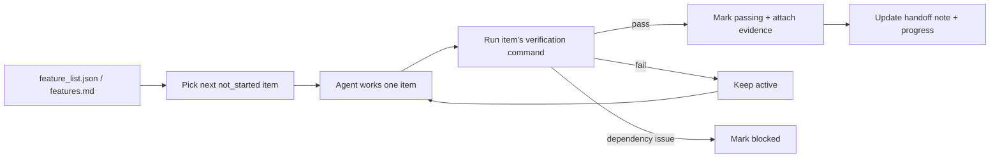

# Lecture 08. Use Feature Lists to Constrain What the Agent Does

You ask an agent to build an e-commerce site. It finishes and reports "done." You look: auth works, but the cart's checkout button does nothing and payment isn't wired up at all. Where did it go wrong? You never defined "done," so the agent used its own: "I wrote a lot of code and it looks fairly complete."

Most people treat a feature list as a memo — jot things down, set it aside. In the harness world it is not a human memo. It is the foundational structure the whole harness is built on: the scheduler picks tasks from it, the verifier judges completion against it, the handoff reporter generates summaries from it. Without it, those components share no consensus to rely on.

Anthropic and OpenAI both insist: **artifacts must be externalized.** Feature state lives in a machine-readable file in the repo, not in unstructured conversation.

## Agents Don't Know What "Done" Means

Neither Claude Code nor Codex automatically knows your definition of done. "Add a shopping cart" might mean, to the model, "write a Cart component and an addToCart method." You meant "user browses products, adds to cart, completes checkout end-to-end." That gap persists until a feature list closes it — otherwise the agent falls back to "no obvious syntax errors."

Consider this progress note:

```
Did user auth, shopping cart mostly done, still need payments
```

What does "mostly done" mean? Which tests passed? What blocks payments? Nobody knows. A new session burns 20 minutes inferring state and may re-implement finished features. Anthropic's data: good progress records cut startup diagnostic time by 60–80%.

## Feature State Machine



Each feature row needs three fields: a **behavior** (e.g. `POST /cart/items returns 201`), a **verification command** (the exact check), and a **state** (`not_started` / `active` / `blocked` / `passing`). All three present = the row is usable.

## Core Concepts

- **Feature lists are harness primitives** — not optional planning tools but the data structure the scheduler, verifier, and handoff reporter all read to function.
- **Triple structure** — every item is `(behavior, verification command, state)`. Behavior says what to do, verification says what counts as done, state says where it stands. Miss one and the item is incomplete.
- **State machine model** — four states; transitions are controlled by the harness, not freely set by the agent.
- **Pass-state gating** — the only path from `active` to `passing` is the verification command succeeding. It's irreversible.
- **Single source of truth** — all "what to do" derives from one list; no contradictions with chat history.
- **Back-pressure** — the count of not-yet-passing features is the pressure on the agent. Zero pressure = project complete.

## Why They Must Be "Primitives"

Documents are for humans to read; primitives are for systems to execute. Documents can be ignored; primitives can't be bypassed. It's the difference between a database trigger constraint (enforced by the engine — no SQL skips it) and an application-layer check (depends on correct code, easy to bypass). The feature list plays the database-constraint role: the agent cannot route around it. Concretely it serves four components — **scheduler** (picks next `not_started`), **verifier** (runs commands, gates transitions), **handoff reporter** (auto-generates summaries), **progress tracker** (tallies state distribution for health metrics).

## How to Do It

**1. Minimal feature-list format** — structured Markdown or JSON, every entry carrying the triple:

```json
{
  "id": "F03",
  "behavior": "POST /cart/items with {product_id, quantity} returns 201",
  "verification": "curl -X POST http://localhost:3000/api/cart/items -H 'Content-Type: application/json' -d '{\"product_id\":1,\"quantity\":2}' | jq .status == 201",
  "state": "passing",
  "evidence": "commit abc123, test output log"
}
```

**2. Let the harness control transitions.** The agent can't set `passing` directly — it submits a verification request; the harness runs the command and decides. That's pass-state gating.

**3. Write the rules in `CLAUDE.md`:**

```
## Feature List Rules
- File: /docs/features.md
- One feature active at a time
- Verification must pass before marking passing
- Don't edit states yourself — the verification script updates them
```

**4. Calibrate granularity to "completable in one session."** "User can add items to cart" is right. "Implement the shopping cart" is too broad. "Create the name field on the Cart model" is too narrow.

## Real-World Case

E-commerce platform, 10 features:

- **Memo mode:** unstructured notes degrade to "cart mostly done but has bugs, payments not started." New session needs 20 minutes to infer state and re-implements finished work.
- **Structured mode:** each feature has a state + verification. New session reads the list and in 3 minutes knows F01–F05 `passing`, F06 `active`, F07–F10 `not_started`; resumes at F06 with zero rework.

Quantified: structured lists show 45% higher completion than free-form tracking, with zero duplicate implementations.

## Key Takeaways

- Feature lists are the harness's foundational structure, not human memos.
- Every item needs the triple: behavior + verification command + state.
- Transitions are harness-controlled; passing verification is the only upgrade path.
- The list is the project's single source of truth.
- Granularity = "completable in one session."

## How this maps to my harness

- **`create-app-implementation-docs` already produces the primitive.** Its `requirements → implementation-plan → validation` chain should compile down to a `feature_list.json` where every task carries the triple (behavior, verification command, state) — the plan stops being prose and becomes the structure the scheduler/verifier read.
- **Adopt a literal pass-gate policy:** a feature flips to `passing` only when the workflow was exercised, evidence recorded, no blocking error in the tested path, and the app isn't left ambiguous. Wire this as the gate, not a suggestion.
- **"No untestable tasks" is the triple enforced** — `repo-engineering-review`'s "has tests vs shows TDD" distinction is exactly the loose-vs-strict verification audit this lecture asks for; a task with no executable check doesn't belong on the list.
- **superpowers `writing-plans` one-session sizing** is the granularity calibration — reject "implement X" rows, demand single-behavior rows.
- **claude-mem is the single-source backstop**: keep scope in the feature list and let observations reference it, so chat history never contradicts the externalized state.
- **langfuse scores can host the evidence trail** — attach verification output / scores to each feature so "passing" is auditable, not asserted.

**Source:** https://walkinglabs.github.io/learn-harness-engineering/en/lectures/lecture-08-why-feature-lists-are-harness-primitives/
