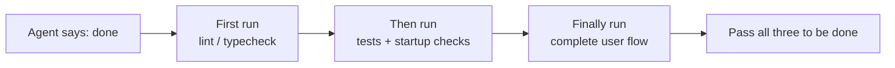

# Lecture 9 — Stop the Agent From Declaring Victory Too Early

You ask the agent to implement "password reset." It changes the DB schema, writes the API endpoint, adds the email template, runs the unit tests (all green), and confidently reports "done." Then you actually run it: the reset link never sends because the email config is missing, the migration failed halfway and left the schema inconsistent, and the end-to-end flow was never executed once.

This is not bad luck. Guo et al. (ICML 2017) showed that modern neural networks are **systematically overconfident** — reported confidence runs well above real accuracy. Coding agents inherit this. They *feel* done long before they *are* done. The harness's job is to replace the agent's feelings with externalized, execution-based verification.

## The slippery slope

Premature completion follows one playbook: the code *looks* fine — syntax valid, logic plausible, static analysis clean — but the harness never forces full execution verification, so the agent runs partial checks (unit tests yes, integration no; tests yes, coverage no) and treats "looks fine" as "feature complete."

Information is lost at every hop: spec → implementation → runtime behavior. Each skipped verification compounds the asymmetry.

## Three-layer termination check



- **Layer 1 — Syntax & static analysis.** Cheapest, least information, but mandatory. Spell the words right before reading further.
- **Layer 2 — Runtime behavior.** Tests execute, the app starts, critical paths run. Evidence that the code is not just written but *runnable*.
- **Layer 3 — System-level confirmation.** End-to-end, integration, real user scenario. The last line of defense: not just runnable, but *correct*.

Rule: do not advance a layer until the one below it passes.

## Core concepts

- **Premature completion declaration** — the agent asserts done while unmet correctness specs remain. Root cause: it judges from local, code-level confidence when correctness is a global property.
- **Confidence calibration bias** — the systematic gap between self-reported confidence and real quality. For multi-file tasks the bias is strongly positive.
- **Termination criteria** — an executable set of conditions in the harness that must all pass. "Done" becomes objective, not a vibe.
- **Verification–validation dual gate** — verification checks the code implements the spec; validation checks system behavior meets end-to-end requirements. Both required.
- **Completion priority constraint** — verify correctness first, then performance, then style. No refactor before core functionality is verified.

## Passing unit tests ≠ task complete

This is the most common and most dangerous trap. Unit tests isolate the unit and mock its dependencies — which is exactly what blinds them to cross-component problems:

- **Interface mismatch** — caller passes a relative path, callee expects absolute. Both unit tests mock the boundary; both pass. Only the end-to-end run exposes it.
- **State propagation** — a migration changes the schema but a cache layer still holds old-schema entries. Fresh-mock unit tests never see cross-layer state.
- **Environment dependency** — correct under mocks, broken in the real environment due to config, latency, or an unavailable service.

### "Refactor while we're here" poisons completion judgment

Agents love to refactor and optimize before core behavior is verified. Knuth's "premature optimization is the root of all evil" gets a new edge here: refactoring moves the boundary between verified and unverified code and can silently break paths that were implicitly correct.

### Self-evaluation is biased

Anthropic (2026) found that when an agent grades its own work it systematically scores too high — even when a human would call the quality clearly substandard. The same model generates and judges, so it is generous with itself. The fix is not "be more objective"; it is to **separate the worker from the checker.** An independent, deliberately nitpicky evaluator beats self-grading.

| Architecture | Runtime | Cost | Core features working? |
|--------------|---------|------|------------------------|
| Single agent (bare run) | 20 min | $9 | No (entities unresponsive to input) |
| Three agents (planner + generator + evaluator) | 6 hr | $200 | Yes (fully playable) |

Same model (Opus 4.5), same prompt ("build a 2D retro game editor"). The only variable is the harness: bare run vs. planner expands → generator builds feature-by-feature → evaluator click-tests with Playwright.

## How to prevent it

**1. Externalize the termination judgment.** The harness decides done, using runtime signals — not the agent's confidence. Spell it out in CLAUDE.md:

```
## Definition of Done
- Feature complete = end-to-end verification passed, not "code is written"
- Levels: 1) unit tests pass  2) integration tests pass  3) e2e flow passes
- Do not advance to a level until the level below passes
```

**2. Run all three layers.** Static → runtime → system, no shortcuts.

**3. Write agent-actionable error messages.** Not `"Test failed"` but `"Test failed: POST /api/reset-password returned 500. Check the email service config in env vars. Template expected at templates/reset-email.html."` Specific + actionable = self-correction without a human.

**4. Capture runtime signals.** Did the app reach ready state? Did the critical path actually execute? Were side effects (DB writes, file ops) correct? Were temp resources cleaned up?

## Real-world case

**Task:** password reset — DB ops, email send, API change.
**Premature path:** schema changed, endpoint written, template added, unit tests green, "done."
**Actual omissions:** (1) e2e never run, the real send/verify was never confirmed; (2) migration failed partway, schema inconsistent; (3) email config missing in the target env.
**Harness intervention:** enforce termination validation — start the full app and hit the reset endpoint, run the complete reset flow, verify DB consistency. All defects caught in-session, at 5–10x less cost than fixing after the fact.

## Key takeaways

- Agents are systematically overconfident; "written" is not "correct."
- Completion judgment must be externalized to the harness.
- All three validation layers are essential — no skipping.
- Error messages should include concrete repair steps.
- No refactor until core functionality is verified.

## How this maps to my harness

- This lecture is already my house policy: "do not mark completion from compile/build success alone." My CLAUDE.md verify-your-work rule (mentally simulate, give a usage example, cover edge cases) is exactly the externalized termination check — keep it explicit as a Definition of Done.
- My `create-app-implementation-docs` validation phase *is* the three-layer gate and then some: typecheck/lint → unit/integration → E2E/smoke/build/CI, plus the rule "verify the running app in a browser/preview, not just a clean build." Treat its `validation-report.md` as the runtime-signal artifact that proves done.
- The Anti-Slop Visual Gate in that skill is the antidote to biased self-evaluation on subjective work (layout/design) — it is my independent "nitpicky checker."
- The superpowers `verification-before-completion` skill is the worker/checker separation in skill form; invoke it before reporting done, not after.
- The worker-vs-checker split maps cleanly onto my eval-* projects and `repo-engineering-review`, which runs real test/lint/audit commands and reports exact outputs (confirmed vs. likely vs. needs-runtime-verification) — that labeling *is* calibration discipline.
- Concrete failures should be written as agent-actionable messages (what/why/how-to-fix) so Opus self-corrects in-session instead of bouncing off "it's wrong."

**Source:** https://walkinglabs.github.io/learn-harness-engineering/en/lectures/lecture-09-why-agents-declare-victory-too-early/
