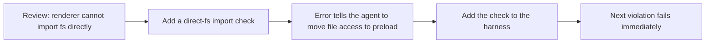

# Lecture 10 — Only a Full Pipeline Run Counts as Real Verification

You ask the agent to add file export to an Electron app. It writes the renderer component, the preload script, and the service layer. Every component's unit tests pass. "Done." Then you click Export: the path format is wrong, the progress bar is dead, and large files leak memory. Five boundary defects, and unit tests caught zero.

Each part is "correct" alone; the problems appear the moment they are wired together. Google's Testing Pyramid says a wide unit-test base is essential — but stopping there systematically misses component-interaction defects. Agents make it worse because they run the fastest tests and stop. **Only end-to-end testing can prove the absence of system-level defects.**

## The blind spots of unit tests

Unit testing's design philosophy is isolation: mock the dependencies, focus on the unit. That is what makes them fast and precise — and what creates systematic blind spots. Each module is perfect in isolation, yet these only surface when everything runs together:

- **Interface mismatch** — renderer passes a relative path, preload expects absolute; both mocked unit tests pass.
- **State propagation** — migration changes the schema; the ORM cache still holds old-schema entries. Fresh-mock unit tests never see it.
- **Resource lifecycle** — file handles, DB connections, sockets span components; per-test setup/teardown hides contention and leaks.
- **Environment dependency** — fine under mocks, broken in the real env from config, latency, or service outages.

## E2E doesn't just change results — it changes behavior

Often overlooked: when the agent *knows* its work will be validated end-to-end, its coding behavior shifts.

1. **It considers interactions** — "how does this interface connect upstream?" instead of one function in a vacuum.
2. **It respects architectural boundaries** — e2e forces it to follow the rules.
3. **It handles error paths** — e2e includes failure scenarios, so it thinks about exceptions.

## Pyramid + review-feedback promotion



OpenAI's Codex practice: **error messages for agents must include fix instructions.** Not `"Direct filesystem access in renderer"` but `"Direct filesystem access in renderer. All file ops must go through the preload bridge. Move this call to preload/file-ops.ts and invoke via window.api."` That turns an architectural rule into an auto-correction loop.

## Core concepts

- **Component boundary defect** — A and B each pass their unit tests, but their interaction is wrong. E2E's specialty.
- **Testing adequacy gradient** — unit ⊆ integration ⊆ e2e in detection power; each layer catches strictly more.
- **Architectural boundary enforcement** — turn architecture-doc rules ("renderer must not touch the filesystem") into executable, automated checks. From paper to CI.
- **Review-feedback promotion** — convert recurring review comments into automated checks. Each new repeated issue adds a rule; the harness grows itself.
- **Agent-oriented error messages** — state what/why/how-to-fix, turning failures into self-correcting loops.

## How to do it

**0. Define architectural boundaries before writing E2E.** E2E on a tangled architecture only proves "the mess runs." OpenAI's experience: for agent-generated codebases, **establish architectural constraints on day one** — agents copy existing patterns, even bad ones, so without constraints every session adds drift. Their Layered Domain Architecture fixes per-domain layers (Types → Config → Repo → Service → Runtime → UI), dependencies flow strictly forward, cross-domain concerns enter via explicit Providers, everything else is forbidden and lint-enforced. Key principle: **enforce invariants, don't micromanage implementation** (require "parse at the boundary," don't dictate the library).

**1. Put an E2E layer in the validation flow:**

```
## Validation Hierarchy
- Level 1: Unit tests (must pass)
- Level 2: Integration tests (must pass)
- Level 3: E2E tests (must pass for cross-component changes)
- Skipping any required level = Not Complete
```

**2. Make architectural rules executable:**

```bash
grep -r "require('fs')" src/renderer/ && exit 1 || echo "OK: no direct fs access in renderer"
```

**3. Design agent-oriented errors** (what / why / how):

```
ERROR: Found direct import of 'fs' in src/renderer/App.tsx:12
WHY: Renderer has no access to Node.js APIs for security
FIX: Move file operations to src/preload/file-ops.ts and call via window.api.readFile()
```

**4. Run a review-feedback promotion process.** Every new agent-error category found in review becomes an automated check. A month later the harness is far stronger than it started.

## Real-world case

**Task:** Electron file export — renderer UI, preload FS proxy, service-layer transform.
**Unit phase:** all three pass (file ops, FS, data source mocked). Agent declares done.

| Defect | Description | Unit | E2E |
|--------|-------------|------|-----|
| Interface mismatch | Inconsistent path format | Missed | Caught |
| State propagation | Progress not sent to UI via IPC | Missed | Caught |
| Resource leak | Large-export handles not released | Missed | Caught |
| Permission | Different perms in packaged build | Missed | Caught |
| Error propagation | Service exceptions never reached UI | Missed | Caught |

E2E caught all 5; unit tests caught none. Cost: test time 2s → 15s — fine in an agent workflow.

## Key takeaways

- Unit tests are systematically blind to boundary defects — isolation is the cause.
- E2E both detects defects and changes how the agent writes code.
- Architectural rules must be executable, checked every commit.
- Error messages must be agent-designed (concrete fix steps).
- Review-feedback promotion makes the harness automatically stronger.

## How this maps to my harness

- My `create-app-implementation-docs` validation gates already include E2E and smoke as named levels — this lecture is the rationale for keeping them mandatory on any cross-component change, not optional.
- The Anti-Slop Visual Gate plus "verify the running app in a browser/preview" is my Level-3 system confirmation; I have the real-browser muscle to back it — `gstack`/`browse`, `playwright`, and `qa`/`verify` skills click the actual flow instead of trusting mocked component tests.
- "Review feedback → durable rule" maps directly onto editing my skills and CLAUDE.md: every recurring correction I make should be promoted into a global rule, a skill step, or a lint/grep check so the next session fails fast instead of repeating the mistake.
- The "enforce invariants, don't micromanage" principle fits my Karpathy rules (simplicity, minimal changes): encode boundaries as checks, leave implementation choices to the agent.
- Agent-oriented error messages (what/why/how) are how I should phrase failing checks so Opus self-corrects in-session — the same self-correction loop `repo-engineering-review` relies on when it reports exact command outputs.
- Architectural-boundary checks belong in CI for my projects (and could be surfaced as Langfuse scores for the AI-eval-shaped ones in eval-ai-ci-gate), so drift is caught mechanically.

**Source:** https://walkinglabs.github.io/learn-harness-engineering/en/lectures/lecture-10-why-end-to-end-testing-changes-results/
