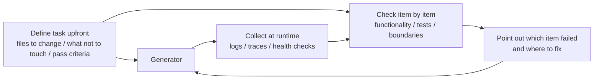

# Lecture 11. Making the Agent's Runtime Observable

You ask an agent to implement a feature. It runs 20 minutes, touches a pile of files, then reports "done, but two tests are failing." Why? "Not sure, might be a timing issue." Which critical paths changed? "Let me look at the code..."

The root cause isn't the agent's capability — it's the harness's lack of observability. When an agent executes without visibility into actual runtime state, every decision is a guess. **Without observability, agents decide under uncertainty, evaluations become subjective, and retries become blind wandering.** OpenAI and Anthropic both frame reliability as an evidence problem: the harness must expose runtime behavior and evaluation signals in a form that can guide the next decision.

## The Real Cost of Missing Observability

- **Can't distinguish "correct" from "looks correct."** Code review shows *what was written*; runtime tracing shows *what actually ran*. A function can pass review yet take a wrong path on a boundary input. You need both.
- **Evaluation becomes mysticism.** Without rubrics and acceptance criteria, evaluators fall back on implicit assumptions, and the same output gets wildly different scores. Non-reproducible.
- **Retries become blind guesses.** Not knowing *why* it failed, the agent retries in a random direction — fixing unrelated paths while ignoring the root cause. Every blind retry burns tokens.
- **Session handoff information cliff.** Incomplete work handed off without observability forces the next session to re-diagnose from scratch. Anthropic: redundant diagnosis eats 30–50% of session time.

## A Real Claude Code Scenario

A "planner → generator → evaluator" workflow building "add dark mode":

- **Without observability:** the planner is vague, the generator guesses, the evaluator rejects on "it doesn't feel right" without articulating why, the generator retries blindly. 3–4 cycles, ~45 minutes, barely acceptable.
- **With observability:** the planner emits a sprint contract (components to change, per-component criteria, exclusions like "no print styles"). Runtime observability records each component's style loading. The evaluator scores by dimension with evidence: "Button contrast 2.1:1, WCAG AA needs 4.5:1." One iteration, ~15 minutes.

3x difference. The only variable is observability.

## Layered Observability

Observability isn't "add more logging." It operates on two layers, both essential.



- **Runtime observability** — system-level signals: logs, traces, process events, health checks. Answers *what did the system do*.
- **Process observability** — visibility into harness decision artifacts: plans, rubrics, acceptance criteria. Answers *why should this change be accepted*.

## Core Concepts

- **Runtime observability** — system signals (logs, traces, process events, health checks).
- **Process observability** — visibility into decision artifacts (plans, rubrics, criteria).
- **Task trace** — a full decision-path record from start to finish, like request tracing in distributed systems; replay the process when something breaks.
- **Sprint contract** — a short agreement negotiated *before* coding: scope, verification standards, exclusions. The core tool of process observability.
- **Evaluator rubric** — turns evaluation from subjective judgment into evidence-based structured scoring so different evaluators converge.
- **Layered observability** — system and process layers designed together: runtime signals explain behavior, process artifacts explain intent.

## Why Agents Can't Solve This Themselves

"Can't the agent just print its own logs?" No:

1. **Agents don't know what they don't know** — they won't record signals they don't realize they need.
2. **Log formats are inconsistent** across sessions, blocking systematic analysis.
3. **Process observability isn't a logging problem** — sprint contracts and rubrics are structured artifacts needing harness-level support.

## How to Build Observability

**1. Build runtime signal collection into the harness** — don't rely on the agent. Auto-collect: application lifecycle (startup/ready/running/shutdown), feature-path execution (entry/checkpoint/exit), data flow between components, abnormal resource usage, and full error context.

**2. Implement sprint contracts** before each task:

```markdown
# Sprint Contract: Dark Mode Support
## Scope
- Modify theme toggle component
- Update global CSS variables
- Add dark mode tests
## Verification Standards
- Visual regression passes per component
- Main-flow E2E passes
- No flash of unstyled content
## Exclusions
- No print styles
- No third-party component dark mode
```

**3. Establish an evaluator rubric** — turn "is it good" into scoring:

| Dimension | A | B | C | D |
|-----------|---|---|---|---|
| Code correctness | All tests pass | Main flow passes | Partial | Build fails |
| Architecture compliance | Fully compliant | Minor deviation | Obvious deviation | Serious violation |
| Test coverage | Main + edge | Main flow only | Skeleton only | None |

**4. Standardize with OpenTelemetry** — a trace per session, a span per task, sub-spans per verification step, so data integrates with standard tools (Jaeger, Zipkin).

## Anthropic's Three-Agent Experiment

Same task ("build a browser DAW with Web Audio API") run with a three-role architecture, phase data recorded:

| Agent & Phase | Duration | Cost |
|---------------|----------|------|
| Planner | 4.7 min | $0.46 |
| Build round 1 | 2 hr 7 min | $71.08 |
| QA round 1 | 8.8 min | $3.24 |
| Build round 2 | 1 hr 2 min | $36.89 |
| QA round 2 | 6.8 min | $3.09 |
| Build round 3 | 10.9 min | $5.88 |
| QA round 3 | 9.6 min | $4.06 |
| **Total** | **3 hr 50 min** | **$124.70** |

- **Planner** — expands a 1–4 sentence requirement into a product spec, told to "be bold in scope" and stay high-level so premature granular detail doesn't cascade errors downstream.
- **Generator** — implements feature by feature; before each sprint negotiates a sprint contract defining "done," then self-evaluates and hands to QA.
- **Evaluator** — drives the running app via Playwright MCP like a real user (UI, APIs, DB state) and scores four dimensions (product depth, functionality, visual design, code quality), each with a hard threshold; miss one and the sprint fails with detailed feedback.

QA round 1 feedback example: "visually impressive with good AI integration, but core DAW features are presentational — clips can't be dragged, no instrument panel, no effects editor." Specific, evidence-backed, not "doesn't feel right." Crucially, the evaluator wasn't born sharp: early versions raised real issues then talked themselves out of them and approved. The fix was reading the evaluator's logs, finding where its judgment diverged from human judgment, and updating the QA prompt — repeated until scoring became reliable.

## Key Takeaways

- Observability is a harness architecture property, designed in from the start.
- Both layers are essential: runtime explains *what happened*, process explains *why this way*.
- Sprint contracts front-load alignment, preventing foreseeable rejections.
- Rubrics make evaluation reproducible.
- Missing observability wastes 30–50% of session time on redundant diagnosis.

## How this maps to my harness

- **context-mode is my runtime/process observability substrate** — think-in-code keeps raw signal out of the window while `ctx_*` tools index it, so I analyze runtime behavior from evidence instead of re-reading it; the `ctx_search` timeline is the task-trace replay this lecture describes.
- **langfuse MCP is the OpenTelemetry layer** — a trace per session, spans per task, scores per verification; its evaluators/score configs are exactly the "evaluator rubric made reproducible," and `eval-*` projects are where I benchmark them.
- **claude-mem observations are the handoff cliff fix** — cross-session observations carry *why* a change was accepted, cutting the 30–50% rediagnosis tax for the next Opus session.
- **`create-app-implementation-docs` already emits the process artifacts** — its `design`/`validation` docs and `docs/prompts/` role prompts are sprint contracts: scope, criteria, exclusions agreed before coding.
- **Adopt the planner/generator/evaluator split with an evaluator rubric** — pair the spec pipeline (planner) with TDD generation and a langfuse-scored evaluator, and tune the QA prompt by reading where its scores diverge from mine, the same loop Anthropic ran.
- **gstack/browse + playwright is my evaluator's hands** — drive the running app like a real user for evidence-backed feedback instead of "looks off."

**Source:** https://walkinglabs.github.io/learn-harness-engineering/en/lectures/lecture-11-why-observability-belongs-inside-the-harness/
