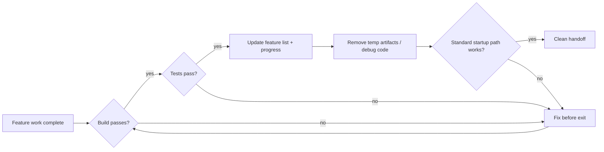

# Lecture 12. Leave a Clean Handoff at the End of Every Session

Your agent runs all afternoon, modifies 20 files, commits, and the session ends. The next session starts and immediately finds: build broken, tests red, temporary debug files scattered everywhere, feature list not updated, progress opaque. Its first 30 minutes go entirely to "figuring out what the last session actually did."

OpenAI and Anthropic both state it plainly: **long-term reliability depends on operational discipline, not just single-run success.** The state you leave at session end directly determines the next session's efficiency.

## Entropy Growth Is the Default

Lehman's laws of software evolution: a system under continuous change inevitably grows more complex unless actively managed. Doubly true for AI coding agents. Every session introduces changes; without exit cleanup, debt compounds.

In five months of Codex experiments, OpenAI saw something striking: **agents copy patterns already in the repo, even inconsistent or suboptimal ones.** Over time this copying drifts. One person leaves a coffee cup; the next figures "it's already messy" and leaves another; a week later the table is buried. Codebases work the same way.

OpenAI first spent 20% of every Friday manually cleaning "AI slop" — which doesn't scale. Their systematic fix:

1. **Encode golden rules in the repo** — concrete, mechanical, auto-checkable ("prefer the shared utility over hand-rolled helpers," "don't YOLO-guess data structures").
2. **Periodic cleanup workflows** — background tasks that scan for deviations, update quality scores, and open targeted refactor PRs, most auto-mergeable within a minute.
3. **Capture human taste once, enforce continuously** — review comments, refactor PRs, and user-facing bugs become doc updates or, when docs aren't enough, get promoted into tooling.

Technical debt is a high-interest loan. Paying it down in small increments beats one massive payoff event.

## Clean State: More Than "It Compiles"

Building without errors is the floor, not the bar. All tests must pass — including pre-existing ones (the session is responsible for not breaking existing behavior) — verified in CI, not just "works on my machine."



Beyond that: progress must be recorded in machine-readable artifacts (completed subtasks + criteria, in-progress + current state, not-started), which cuts startup diagnostic time 60–80%. Temporary artifacts — debug logs, temp files, commented-out code, stray TODOs — must be removed; they raise the next session's cognitive load. And the standard startup path must still work: env init, codebase load, context acquisition, task selection — none broken, no manual intervention required.

## Core Concepts

- **Clean state** — session end satisfies five conditions: build passes, tests pass, progress recorded, no stale artifacts, startup path available. Miss one and the session isn't done.
- **Session integrity** — like a database transaction: fully commit to a clean state, or roll back to the last consistent one. No middle ground.
- **Quality document** — an active artifact tracking per-module quality grades over time (getting stronger or weaker), not a one-time assessment.
- **Cleanup loop** — routine maintenance to systematically reduce entropy, not emergency firefighting.
- **Harness simplification** — as models improve, periodically remove components no longer needed.
- **Idempotent cleanup** — cleanup yields the same result however many times it runs, safe under failure-retry.

## "Clean Up Later" Means Never

The next session doesn't know what you left behind — it sees a mess and uncertain state, and wastes time inferring which code is intentional vs temporary. Worse, it's there to do *new* work, not clean yours, so it builds on the chaos and adds more. Entropy's positive feedback loop.

A 12-week agent project **without** cleanup:

- Week 1: build 100%, tests 100%, startup 5 min
- Week 4: 95%, 92%, 15 min
- Week 8: 82%, 78%, 35 min
- Week 12: 68%, 61%, 60+ min

**With** cleanup: Week 1 identical; Week 12 — 97%, 95%, 9 min. After 12 weeks: build pass rate differs 29 points, startup time 85%. Observed, not theoretical.

## How to Do It

**1. Clean state is a necessary completion condition.** Session done = task verified **AND** clean-state check passes. In `CLAUDE.md`:

```
## Session Exit Checklist
- [ ] Build passes (npm run build)
- [ ] All tests pass (npm test)
- [ ] Feature list updated
- [ ] No debug code remaining (console.log, debugger, TODO)
- [ ] Standard startup path available (npm run dev)
```

**2. Dual-mode cleanup.** *Immediate* (every session end): remove temp artifacts, update feature state, ensure build+tests green — "reference counting." *Periodic* (weekly): full-system scan for structural issues, update quality docs, run a benchmark slice to detect drift — "tracing."

**3. Maintain a quality document** scoring each module (verification passing, agent-understandable, test stability, architecture boundaries, conventions). New sessions read it and fix the lowest-scoring module first.

**4. Periodically simplify the harness.** Every component exists because the model couldn't reliably do something — but models improve. Anthropic removed a sprint-splitting mechanism once Opus 4.6 could decompose work itself; the builder then ran 2+ hours without drifting. Yet the evaluator still earned its keep near the capability boundary, catching stubs and missing functionality. So: monthly, disable one component, run benchmarks — if results hold, remove it; if not, restore or lighten it. Deeper principle: as models improve, the valuable combinations don't shrink, they *shift*.

**5. Cleanup must be idempotent:**

```bash
rm -f /tmp/debug-*.log      # -f: no error when absent
git checkout -- .env.local  # restore to known state
npm run test                # verify cleanup didn't break anything
```

**6. High throughput changes the merge philosophy.** When agent output far exceeds human review capacity (OpenAI saw 3.5+ PRs/day per agent), minimize blocking gates: keep PRs short-lived, let flakiness resolve on rerun rather than block indefinitely. Criterion: **average cost to fix a bug vs average cost to wait for human review.** When fixing is cheaper than waiting, fast-merge. (Irresponsible in low-throughput settings — know which regime you're in.)

## Real-World Case

Electron app, 12 weeks of agent development:
- **Without cleanup:** Week 12 — build 68%, tests 61%, startup 60+ min, 103 stale artifacts.
- **With cleanup:** clean-state check every session + weekly loop. Week 12 — build 97%, tests 95%, startup 9 min, 11 stale artifacts.

+5 minutes per session bought dozens of saved hours over 12 weeks.

## Key Takeaways

- Clean state is a necessary completion condition — part of the definition of done.
- All five dimensions are non-negotiable: build, tests, progress, artifacts, startup.
- Quality documents make codebase health trackable.
- Periodically simplify the harness as models improve.
- "Clean up later" equals never. Entropy is the default; only active cleanup counters it.

## How this maps to my harness

- **superpowers `finishing-a-development-branch` is my session-exit transaction** — it's the structured "commit clean or roll back" gate that enforces build/tests/progress before the branch is considered done.
- **A `CLAUDE.md` clean-state checklist** (build, tests green, feature list updated, no `console.log`/`debugger`/stray TODO, startup path works) makes "done" mean clean state, not just "compiles."
- **The `bash-guard` PreToolUse hook keeps cleanup safe and idempotent** — it blocks the dangerous half of cleanup (rm -rf, reset --hard, force push, DROP/TRUNCATE, truncate, dd), so routine entropy-reduction can run without risking a destructive slip.
- **context-save / context-restore are the machine-readable progress artifact** — capturing git state, decisions, and remaining work is exactly the handoff record that cuts the next session's startup diagnosis 60–80%.
- **`repo-engineering-review` is my quality document + weekly cleanup loop** — its evidence-based audit and numbered portfolio README sections grade modules over time and surface the lowest-scoring one to fix first.
- **Benchmark drift with langfuse + `eval-*`** — run a fixed eval slice after cleanup (harness-A-vs-harness-B style) to confirm cleanup didn't regress quality, and to decide which harness component to simplify away as Opus 4.8 absorbs old constraints.
- **claude-mem closes the "capture taste once" loop** — recurring review findings become persistent observations/rules instead of being re-litigated every session.

**Source:** https://walkinglabs.github.io/learn-harness-engineering/en/lectures/lecture-12-why-every-session-must-leave-a-clean-state/
